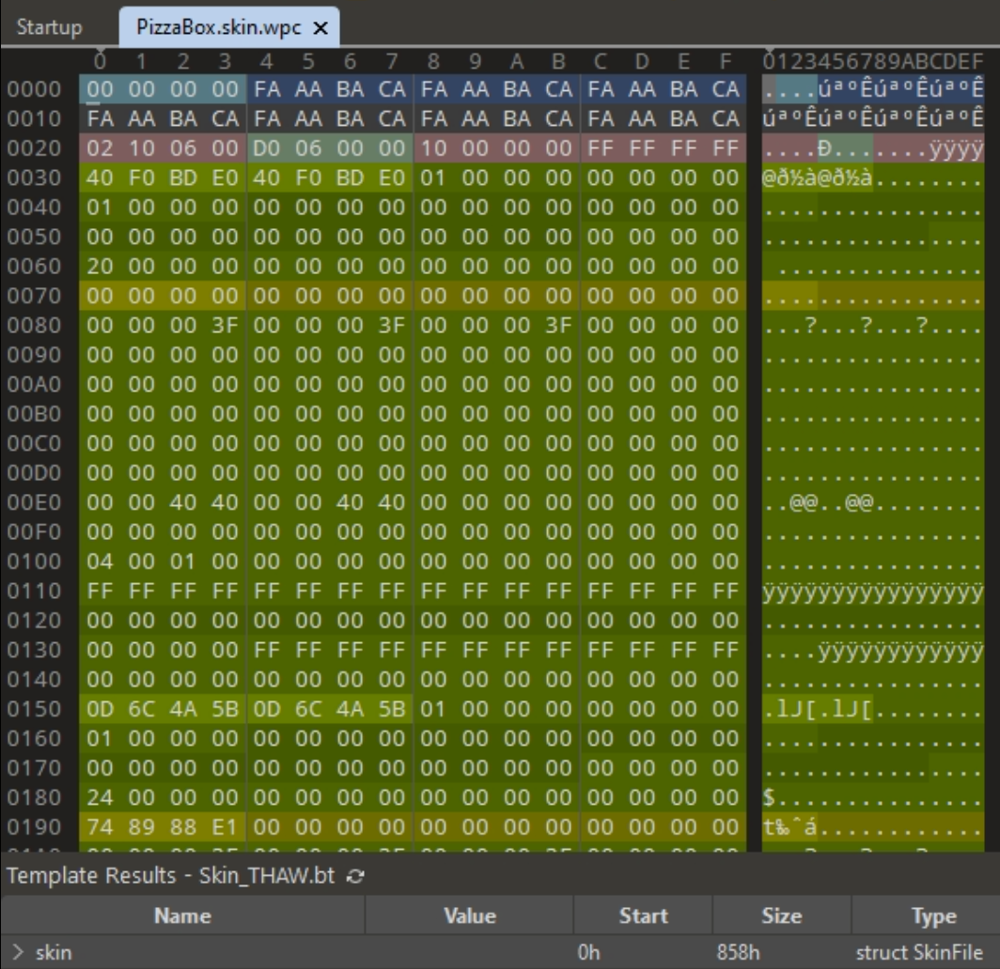

# Animation conversion (thug / thug2 -> thaw)

## Prerequisites

To load the animations into THAW, set up the Guitar Hero SDK as described here [TODO].<br>
**You need to install Node JS to use the converters!**<br><br>
An animation consists of multiple parts that need to be converted separately with the following tools:

- Extractor: ([PreTool](https://github.com/atljp/thps-modding-resources/blob/main/Tools/PreTool.exe)) - File ending: .pre/.prx
- Human Animation ([AnimConverter](https://github.com/atljp/thps-modding-resources/tree/main/Tools/AnimConverter)) - File ending: .ska.xbx
- Optional: Special Item Animation (also [AnimConverter](https://github.com/atljp/thps-modding-resources/tree/main/Tools/AnimConverter)) - File ending: .ska.xbx
- Skeleton ([SkelConverter](https://github.com/atljp/thps-modding-resources/tree/main/Tools/SkelConvert)) - File ending: .ske
- Skin ([SceneConverter](https://github.com/atljp/thps-modding-resources/tree/main/Tools/SceneConv)) - File ending: .skin
- Feb 2024: To mark skins as active easily use [010 Hex Editor](https://www.sweetscape.com/010editor/). The converter doesn't do it automatically yet.

Animations and skeletons can be extracted from netanims.prx and skeletons.prx respectively (the ending may be .pre or .prx).<br>
For THUG and THUG2 these are at path: `Game/Data/pre`<br><br>
Only for animations with special items: The skin files are located at: `Game/Data/models/Specialitems/<Itemname>`<br>
While the data has to be in the right format at the right place, the tricks themselves also have to be described in the scripts. It's a good starting point to know which files are needed and what to name them.

## General info
There are three types of animations:
- Simple tricks with a single animation file (e.g., Kickflip, Pop Shove It, etc.)
- Multi-part tricks with 3 separate animations: *Init*, *Idle* and *Out* (e.g., holdable Grab tricks)
- SpecialItem tricks that spawn additional items (e.g., Pizzabox, Tongue, Chainsaw, Kite, etc.)

## Example part 1: Looking at the scripts of THUG SpecialItem trick *Chomp On This*

Since we are porting the trick from Tony Hawk's Underground, we can look at the [original scripts](https://github.com/atljp/thps-modding-resources/tree/main/Scripts/THUG/THUG_vanilla_scripts_(decompiled)) to see how the trick is embedded into the trick system there.
- Every trick, no matter the category, has to be in the `ConfigurableTricks` array in `game\skater\alltricks.qb`
- The files that contain the trick descriptions are in `airtricks.qb`, `groundtricks.qb`, `grindscripts.qb`, `manualtricks.qb` or `liptricks.qb` in the same folder.
- Special items are described in `specialitems.qb` in the same folder.

### General trick description

Looking at the description of *Chomp On This* in `game\skater\airtricks.qb` (formatted):

```
:i $Trick_ChompOnThis$ = :s{
    $Scr$ = $GrabTrick$$Params$ = :s{
        $Name$ = %sc(13,"Chomp On This")
        $Score$ = %i(1000,000003e8)
        $Anim$ = $ChompOnThis_Init$
        $Idle$ = $ChompOnThis_Idle$
        $OutAnim$ = $ChompOnThis_Out$
        $IsSpecial$
        $maxspeed$ = %f(0.900000)$ForceInit$
        $Stream$ = $ChompOnThis$
        $SpecialItem_details$ = $PizzaBox_details$
        $Speed$ = %f(0.900000)
    :s}
:s}
```

Note that `SpecialItem_details` links to `PizzaBox_details` which is another script found in `game\skater\specialitems.qb`:

```
:i $pizzabox_details$ = :s{
	:i $Position$ = %vec3(0.000000,0.000000,0.000000)
	:i $Angles$ = %vec3(0.000000,0.000000,0.000000)
	:i $Name$ = $PizzaBox$
	:i $Class$ = $GameObject$
	:i $Type$ = $SpecialItem$
	:i $CollisionMode$ = $None$
	:i $IgnoredLights$ = :a{%i(0,00000000);%i(1,00000001):a}
	:i $skeletonName$ = $PizzaBox$
	:i $animName$ = $animload_si_pizza$
	:i $model$ = %s(35,"specialitems/pizzabox/pizzabox.skin")
	:i $SuspendDistance$ = %i(0,00000000)
	:i $lod_dist1$ = %i(400,00000190)
	:i $lod_dist2$ = %i(401,00000191)
	:i $TriggerScript$ = $PizzaBox_Script$
:i :s}
```

These scripts can be pretty much copied into the THAW scripts after a few syntax changes. They also tell us right away which files we need.<br>
The trick is a Multi-part **and** SpecialItem trick. We therefore have two separate animations, one for the skater and one for the special item. A special item also has a skeleton and a skin.<br><br>

This what it looks like in the original game - Tony Hawk's Underground:
<br>

## Example part 2: Converting the data to THAW format

This is a two step process, first the items are extracted / copied over and then they are converted to the correct THAW-format.

### 1. Extracting and renaming animations

There are Init-, Idle- and Out animations for the skater (Human_) and the special item (SI_).<br>
Therefore we will extract and rename six animations, three for each category:

#### Human animations

**Extraction (PreTool)**:<br>
Load `Game/Data/pre/netanims.pre`, then right click and extract the following animations. Make sure the *Full File Name* starts with *anims\THPS5_skater_special*:
<br>

Save the three files to the `AnimConverter/in` folder:
- ChompOnThis_Init.ska.xbx
- ChompOnThis_Idle.ska.xbx
- ChompOnThis_Out.ska.xbx

**Renaming**:<br>
Internally, the skater animations are processes as the addition of the qb key of THPS7_Human + \<AnimName\>. A convenient way to generate these qb keys is to use a [QB Key Adder](https://ghwt.de/tools/qbkey):
<br>

Rename the extracted files to the resulting 8 digit hex value and prepend `0x`. After renaming, you should have these filenames: 

- THPS7_Human + ChompOnThis_Init => 0x8EA1EBC7.ska.xbx
- THPS7_Human + ChompOnThis_Idle => 0x88F1BC66.ska.xbx
- THPS7_Human + ChompOnThis_Out => 0xFF890288.ska.xbx

Place them in the `AnimConverter/in` folder like this:
<br>

#### Special item animations

The process is pretty much the same as for the human animations, but with three key differences:
- The animation files still come from `Game/Data/pre/netanims.pre` but the *Full File Name* starts with *anims\SI_Pizza*
- Don't extract the special item animations to the `AnimConverter/in` folder right away. Make a temp folder to rename them there.
- Generate the QB Keys as such: SI_Pizza + \<AnimName\>

**The AnimConverter converts all files contained in the `AnimConverter\in` folder at once. Since human and special item animations are converted differently, they have to be converted separately. That's why the special item anims should be places somewhere else first (for example a temporary folder)!**

This is how the files shoud look like after renaming:
- SI_Pizza + ChompOnThis_Init => 0xA719DEF4.ska.xbx
- SI_Pizza + ChompOnThis_Idle => 0xA169AF93.ska.xbx
- SI_Pizza + ChompOnThis_Out => 0x1800F5B5.ska.xbx

### Converting the animations

Start with the human animations which are in the `AnimConverter\in` folder:<br>
Conversion for the three renamed files is a single command line:<br><br>
`node .\AnimConvert.js thug1 thaw -map .\thug_to_thaw.txt`
<br><br>
We can delete the human animation files in the `AnimConverter\in` folder and put the special item files in (you may have extracted them to a temporary folder before).<br>
Convert the three renamed files with the following command (special item animations don't require a mapping):<br><br>
`node .\AnimConvert.js thug1 thaw`
<br><br>
After the animation-conversion, your `AnimConverter\Out` folder should look like this (file ending: .ska.wpc):
<br>
<br><br>
Place the six converted files into the reTHAWed mod folder `rethawed\Packages\rethawed_anims\Compiled`

### 2. Extracting the special item skeleton

Extract the special item skeleton from `Game/Data/pre/skeletons.pre` with PreTool.
<br>

No renaming is required, just put the *SI_Pizza.ske.xbx* file into the `SkelConvert` folder.<br>
Convert it with the command:<br><br>
`node SkelConvert.js .\SI_Pizza.ske.xbx`<br><br>
This will result in *SI_Pizza.ske.wpc*. Place it where you've placed the converted animations before (`rethawed\Packages\rethawed_anims\Compiled`).

### 3. Converting the special item skin

The skin doesn't have to be extracted, they are loose files at path `Game/Data/models/SpecialItems/Pizzabox`.<br>
Copy only the *PizzaBox.skin* and *PizzaBox.tex* files into `SceneConv`.<br>
Convert the .skin file with the command:<br><br>
`node .\convert.js .\Pizzabox.skin thug thaw`<br><br>
Remove *_thaw* from the resulting file names and rename *.wpc.wpc* to *skin.wpc*. This should result in two files:
- PizzaBox.skin.wpc
- PizzaBox.tex.wpc

Place these two files in the reTHAWed mod folder: `rethawed\Packages\rethawed_anims\Compiled\models\SpecialItems\Pizzabox`

#### Marking the scin as active

As of Feb 2024, the SceneConverter doesn't mark the converted skins as *active* yet. This has to be manually done, ideally with [010 Hex Editor](https://www.sweetscape.com/010editor/) and the [THAW skin template](https://github.com/atljp/thps-modding-resources/blob/main/Guitar%20Hero%20SDK/Resources/Templates/THAW/Skin_THAW.bt).<br>

- Open *PizzaBox.skin.wpc* with the 010 Editor
- Load the template via Templates -> Open Template...
- The floating template window has a run button: Run the template on the file

<br>

The file should now be displayed like this:
<br><br>
Expand the menu where it says `> skin` at the bottom. Then navigate to `skin -> scene -> sectors -> CGeom -> sMesh`<br>
Some skins have only one mesh. In this case, however, there are six meshes. Expand each one and set the `some_flags` field to 1088 (0x40 0x04 in hex).

## Putting it all together: Add the trick to the THAW scripts:

The following changes are meant to be done inside the reTHAWed mod folder.

First, add the trick to `rethawed/Packages/qb/Source/scripts/game/skater/alltricks.q`: Add `Trick_ChompOnThis` anywhere in the array, ideally append new tricks at the bottom.<br><br>
Then. take the trick description from the THUG scripts and change the syntax for the NodeQBC compiler (instead of ROQ).<br>
File: `rethawed/Packages/qb/Source/scripts/game/skater/airtricks.q`

```
Trick_ChompOnThis = {
	scr = GrabTrick
	params = {
		name = "Chomp On This"
		Speed = 0.900
		Score = 1000
		Anim = ChompOnThis_Init
		Idle = ChompOnThis_Idle
		Idle
		OutAnim = ChompOnThis_Out
		maxspeed = 0.900
		ForceInit
		IsSpecial
		specialitem_details = PizzaBox_details
	}
}
```

Add the special item description from THUG and change the syntax as well.<br>
File: `rethawed/Packages/qb/Source/scripts/game/skater/specialitems.q`

```
pizzabox_details = {
	position = (0.0, 0.0, 0.0)
	angles = (0.0, 0.0, 0.0)
	Name = PizzaBox
	Class = GameObject
	Type = SpecialItem
	CollisionMode = None
	IgnoredLights = [ 0 1 ]
	skeletonName = SI_Pizza
	animName = animload_SI_Pizza
	model = 'specialitems\pizzabox\pizzabox.skin'
	SuspendDistance = 0
        lod_dist1 = 400
        lod_dist2 = 401
	//TriggerScript = $PizzaBox_Script$
}
```

### Notes:

- I'm not sure yet how to port the audio stream that's why it's not listed here
- The triggerscript is unused for the other tricks as well, not sure what its purpose is
- The skeleton name has to be the name of the actual file at `rethawed\Packages\rethawed_anims\Compiled`. The filename and the reference in the THUG script `pizzabox_details` differ.
- After everything is converted, copied and added to the scripts: Compiled qb, then Pack + Sync via the SDK

